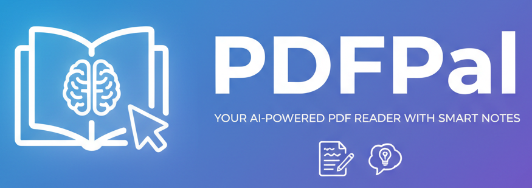

# PDFPal - Your AI-powered PDF reader with smart notes
<p align="center">
    <picture>
        
    </picture>
</p>


<p align="center">
  <a href="LICENSE"></a>
</p>

A lightweight macOS PDF reader with an integrated LLM chat panel. Select text in a paper, invoke an LLM, and keep model-specific chat sessions alongside the document.

## Features

- Open and read local PDFs with PDFKit
- Select text and invoke an LLM from a context menu
- Split-view layout: PDF on the left, chat on the right
- Note renderer: render notes as markdown on the right (WIP)

## Table of Contents

- [LLM Paper Reading Helper](#llm-paper-reading-helper)
  - [Features](#features)
  - [Table of Contents](#table-of-contents)
  - [Project Structure](#project-structure)
  - [Prerequisites](#prerequisites)
  - [Getting Started](#getting-started)
  - [Development](#development)
  - [Build and Release](#build-and-release)
  - [Packaging](#packaging)
  - [Cleaning](#cleaning)
  - [Configuration](#configuration)
  - [License](#license)

## Project Structure

```txt
LLMPaperReadingHelper
├── src/
│   └── macos/              # macOS SwiftUI app
│       ├── app-shell.swift
│       ├── chat-panel.swift
│       ├── llm-client.swift
│       ├── llm/
│       │   ├── claude-client.swift
│       │   └── openai-client.swift
│       ├── pdf-viewer.swift
│       └── session-store.swift
├── docs/                   # Component docs
├── resource/               # App resources (icon)
├── dist/                   # Build artifacts
├── Makefile
└── Package.swift
```

## Prerequisites

- macOS
- Xcode with Swift toolchain
- Swift Package Manager (included with Xcode)

## Getting Started

```bash
git clone <your-repo-url>
cd LLMPaperReadingHelper
make dev
```

## Development

```bash
make dev   # Run the macOS app via SwiftPM
```

## Build and Release

```bash
make build   # Build the macOS app
make release # Build a release .app bundle in dist/
```

## Packaging

```bash
make package # Build and zip a release bundle in dist/
```

The output zip is placed in `dist/LLMPaperReadingHelper.zip`.

## Cleaning

```bash
make clean # Remove build artifacts and dist bundle
```

## Configuration

- API keys are entered in the app UI and stored locally in the Keychain.
- Each model family maintains its own session list and chat history.
- Supported model families: OpenAI, Claude, Gemini.

## License

Apache-2.0 License - see the [LICENSE](LICENSE) file for details.
